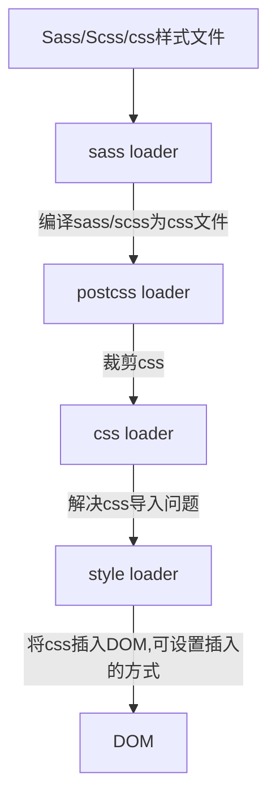

# Nav Extension 开发

## 浏览器插件开发

插件包含下面几部分组成：

- manifest.json 插件配置清单
- background.js 后台脚本
- popup.html 弹窗页面
- options.html 配置页面

## 项目技术选型

- TypeScript
- React
- TailwindCSS
- Webpack
- Babel

为了方便代码提示（21 世纪），此项目使用了 Typescript 进行代码提示和编译。
另使用 React 构建插件页面，使用 TailwindCSS 进行样式管理。
通过 webpack 打包生成插件不同的页面。
使用 babel 支持现代 es 语法。

## 开发环境准备

### Typescript

> yarn add -D typescript

- 安装 typescript
- 使用 tsc 命令行，初始化 typescript 配置
  - `tsc --init`初始化配置文件`tsconfig.json`
- 禁止 typescript 编译输出文件
  - 开启`noEmit`配置或者使用`--noEmit`命令行参数
- 运行 tsc 命令行执行 typescript 检查

### React

> yarn add react react-dom @types/react @types/react-dom

- 安装 react,react-dom 以及相关的 typescript 类型包@types/react,@types/react-dom
- 将 React 挂载至 html 节点

### Webpack

> yarn add -D webpack webpack-cli webpack-dev-server \
> html-webpack-plugin clean-webpack-plugin copy-webpack-plugin \
> sass sass-loader postcss postcss-loader css-loader style-loader babel-loader

- [babel-loader](Babel webpack 插件)
  - js 语法转换工具，可以支持最新的 js 规范，将其编译为兼容的代码
- [ts-loader](https://webpack.js.org/guides/typescript/)
  - 用于 webpack 编译 TypeScript，使用 tsc 命令和 tsconfig.json 配置文件
- [html-webpack-plugin](https://github.com/jantimon/html-webpack-plugin#options)
  - 自动在 html 页面引入编译后的文件，如：js bundle/css 等
  - 如果需要使用指定的 html 生成，需要指定配置`template`使用特定的 index.html 文件
  - 使用`chunks`配置，指定不同 html 引入的 chunks 文件
- [clean-webpack-plugin](https://github.com/johnagan/clean-webpack-plugin)
  - 清理 webpack 打包目录 dist 下的文件
  - 设置`dry`显示清理动作，默认为 false
- [copy-webpack-plugin](https://webpack.js.org/plugins/copy-webpack-plugin/#getting-started)
  - 打包时复制文件到指定目录
  - Flat 复制和 Context 复制控制复制的表现，默认是保持复制目录结构
- [mini-css-extract-plugin](https://github.com/webpack-contrib/mini-css-extract-plugin)
  - 提取 style 至独立文件

#### Webpack Server

[官方文档](https://webpack.js.org/configuration/dev-server/#serveindex)
| [webpack server 脚手架参数](https://github.com/webpack/webpack-cli/blob/master/SERVE-OPTIONS-v4.md)

运行开发服务，提供实时预览。

[简化编译输出](https://webpack.js.org/configuration/stats/#stats)

### Babel 设置

> yarn add -D @babel/core @babel/preset-env @babel/preset-react @babel/preset-typescript

- babel 依赖
  - @babel/core @babel/cli
  - @babel/preset-env 预设环境
  - @babel/preset-typescript typescript 预设
  - @babel/preset-react react 预设
    - 修改 tsconfig.json `jsx => react`
  - [babel-loader webpack 打包](https://webpack.docschina.org/loaders/babel-loader/)
- 添加 babel 设置文件

  ```json
  {
    "presets": ["@babel/preset-env", "@babel/preset-typescript", "@babel/react"]
  }
  ```

- 通过安装并使用`preset-\*预设配置包定义 babel 规则
- webpack module 添加规则使用`babel-loader`处理 ts 和 js 的处理（babel 可以编译 ts，但不能进行 ts 静态检查，所以只使用 babel 进行 ts 编译，另 babel 暂不支持三类特殊情况，详情见[typescript 官方文档](https://www.typescriptlang.org/docs/handbook/babel-with-typescript.html)）

### TailwindCSS 初始化

> yarn add -D tailwindcss autoprefixer postcss

#### 文档

[style loader](https://webpack.docschina.org/loaders/style-loader/)
| [css loader](https://webpack.docschina.org/loaders/css-loader/)
| [postcss loader](https://webpack.docschina.org/loaders/postcss-loader/)
| [sass loader](https://webpack.docschina.org/loaders/sass-loader/)

- 初始化 tailwindcss 配置文件
- 指定代码内容规则
- 设置 postcss 使用 tailwindcss 处理
- 各个 loader 配置使用独立配置文件，如：postcss 配置文件为：`postcss.config.js`

  ```js
  module.exports = {
    plugins: {
      tailwindcss: {},
      autoprefixer: {},
    },
  }
  ```

- webpack modules 添加 css 处理规则

[初始化文档](https://tailwindcss.com/docs/installation/using-postcss)



> 要使 css 处理流程生效，需要在 index.[tj]s 代码 `import index.css` 文件才能生效

## 说明

- typescript 使用 babel

  - [官方说明](https://www.typescriptlang.org/docs/handbook/babel-with-typescript.html) - `tsconfig.json`特定设置的开启

  ```json
    "compilerOptions": {
    // Ensure that .d.ts files are created by tsc, but not .js files
    "declaration": true,
    "emitDeclarationOnly": true,
    // Ensure that Babel can safely transpile files in the TypeScript project
    "isolatedModules": true
    }
  ```

- [官方新手教程](https://github.com/Microsoft/TypeScript-Babel-Starter)

  - 设置开发环境

- [完整流程教程](https://iwenson.com/react-with-tailwindcss-from-scratch/)
